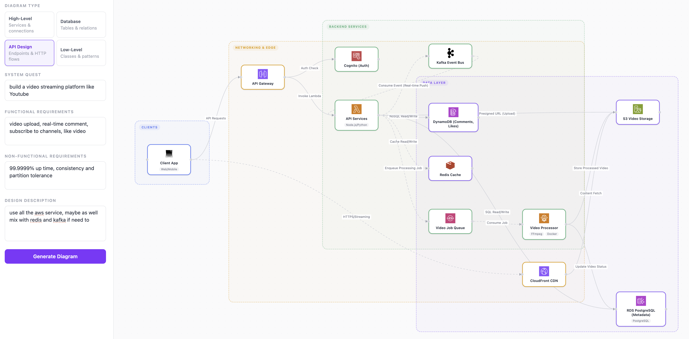
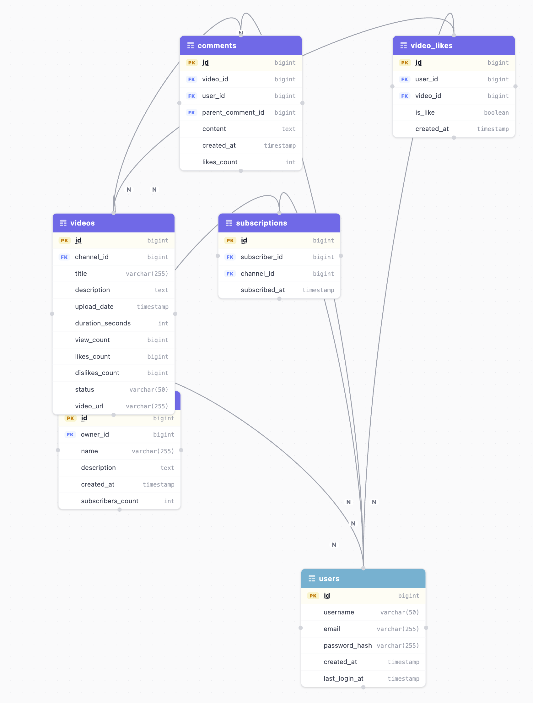
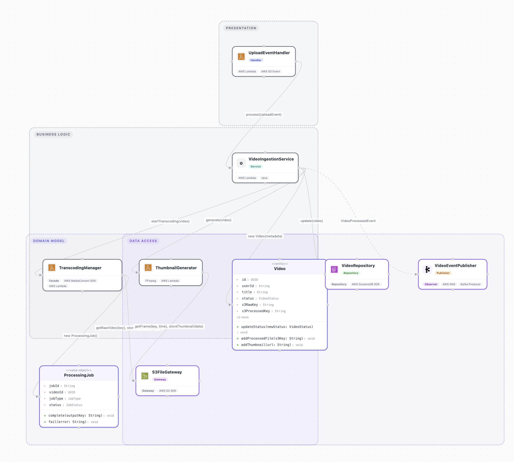

# ArchSketch

AI-powered system design diagram generator. Describe your system and get interactive, draggable architecture diagrams — high-level architecture, database schema, API design, and low-level component diagrams.

## How It Works

Fill in your system requirements (quest, functional/non-functional requirements, design description), pick a diagram type, and click **Generate Diagram**. The backend routes the request to NVIDIA NIM's free cloud models (`mistralai/mistral-small-4-119b-2603` first, then `glm-5.2` / `inkling` / `minimax-m2.7`), falling back to a local Ollama model (`gemma4:e2b`) if NVIDIA is unavailable or no API key is set.

## Stack

| Layer | Technology |
| --- | --- |
| Frontend | Vite + React 19 + TypeScript |
| Styling | Tailwind CSS v4 |
| Diagrams | React Flow (`@xyflow/react`) |
| Auto-layout | dagre |
| State | Zustand |
| Backend | FastAPI (Python 3.14) |
| Local AI | Ollama — `gemma4:e2b` |
| Cloud AI | NVIDIA NIM (free) — `mistral-small-4` → `glm-5.2` → `inkling` → `minimax-m2.7` |
| Validation | Pydantic v2 |

## Project Structure

```text
arch-sketch/
├── backend/
│   ├── main.py                  # FastAPI entry point
│   ├── api/routes/generate.py   # POST /api/generate
│   ├── models/                  # Pydantic request & diagram models
│   ├── services/                # OllamaClient, NvidiaClient, ModelRouter, JSON repair
│   └── prompts/                 # Prompt templates per diagram type
├── client/
│   ├── src/
│   │   ├── api/                 # Axios API client
│   │   ├── components/          # InputForm, DiagramCanvas, DiagramTabs
│   │   ├── nodes/               # Custom React Flow nodes
│   │   ├── edges/               # Custom React Flow edges
│   │   ├── lib/                 # iconRegistry, diagramMapper, layoutEngine
│   │   ├── store/               # Zustand store
│   │   └── types/               # TypeScript types matching JSON contract
│   └── public/                  # Static assets & icons
├── docker-compose.yml
└── README.md
```

## Running the App

### Option A — Docker (recommended)

Requires [Docker Desktop](https://www.docker.com/products/docker-desktop/).

```bash
# Clone and enter the project
git clone <repo-url> arch-sketch
cd arch-sketch

# Set your free NVIDIA API key (get one at build.nvidia.com) for the cloud provider
export NVIDIA_API_KEY=nvapi-your_key_here

# Build and start all three services (client, backend, ollama)
docker compose up --build

# First run only: pull the AI model into the Ollama container
docker compose exec ollama ollama pull gemma4:e2b
```

| Service | URL |
| --- | --- |
| Frontend | <http://localhost:3000> |
| Backend API | <http://localhost:8000> |
| Ollama | <http://localhost:11434> |

To stop: `docker compose down`. Model data is persisted in the `ollama_data` Docker volume.

---

### Option B — Local Development

#### Prerequisites

- Python 3.14+, [uv](https://docs.astral.sh/uv/)
- Node.js 18+, Yarn
- [Ollama](https://ollama.com/) installed and running

#### 1. Ollama

```bash
ollama pull gemma4:e2b
# Ollama starts automatically on most installs; if not:
ollama serve
```

#### 2. Backend

```bash
cd backend

# Install dependencies (creates .venv from uv.lock)
uv sync

# Add your free NVIDIA API key (get one at build.nvidia.com)
echo "NVIDIA_API_KEY=nvapi-your_key_here" > .env

# Start the server
uv run uvicorn main:app --reload --port 8000
```

#### 3. Frontend

```bash
cd client
yarn install
yarn dev
```

The app will be at **<http://localhost:5173>**.

---

## Diagram Types

| Type | Description |
| --- | --- |
| **High-Level Architecture** | Services, components, load balancers, databases, and their connections |
| **Database Schema** | Tables, columns, PKs/FKs, and relationships with cardinality |
| **API Design** | Services with endpoints, HTTP methods, and inter-service calls |
| **Low-Level Design** | Internal layers — controllers, services, repositories, domain classes, and design patterns |

## Features

- **Tab switching** — generate all four diagram types and switch between them without losing any
- **Regenerate** — re-run the last generation for the active diagram with one click
- **Export PNG** — download the current diagram as a high-resolution PNG
- **Ollama status** — live indicator in the sidebar shows whether the local model is reachable

## Model Routing

1. **NVIDIA NIM** — tried first; each model is attempted in order (fastest-first) until one returns valid JSON (free tier at [build.nvidia.com](https://build.nvidia.com)):
   1. `mistralai/mistral-small-4-119b-2603` — primary, fastest (~12s)
   2. `z-ai/glm-5.2` — ~33s, strongest JSON output
   3. `thinkingmachines/inkling` — ~37s
   4. `minimaxai/minimax-m2.7` — ~38s
2. **JSON repair** — strips markdown fences, fixes trailing commas, validates schema
3. **Ollama** (`gemma4:e2b`) — local fallback if all NVIDIA models fail or no API key is set

## Demo



